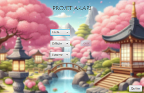

# Projet jeu Akari

Ce fichier `README.md` présente mon projet de fin de second semestre de première année de BUT Informatique, développé avec JavaFX.

---

Un akari est un jeu mathématique de logique sous forme d'une grille comprenant des cases noires et des cases blanches. Le but du jeu est d’éclairer chaque case blanche en plaçant des ampoules (représentées par des cercles) aux bons endroits.
[Règles Akari](https://fr.wikipedia.org/wiki/Akari_(jeu_de_logique))

## 1. Liste des fonctionnalités minimales développées

* Montrer explicitement si les cases contiennent des murs, des lampes, si elles sont éclairées 
ou non, s’il y a une contrainte numérique sur un mur 
* Montrer à l'utilisateur s'il fait une erreur
* Ne pas permettre de cliquer sur un mur
* Savoir quand la partie est gagnée
  
## 2. Liste des fonctionnalités bonus développées

* Pouvoir marquer des cases pour aider à la réflexion avec un clic droit sur une cellule (et 
pouvoir retirer les marques)
* Permettre de faire plusieurs parties à la suite 
* Compter et afficher un score
* Permettre de lire un fichier de grille sur mon ordinateur
* Permettre de jouer sur des grilles de tailles différentes
* Mettre un son lors de la victoire du joueur
* Ne pas permettre au joueur d’utiliser à nouveau les lumières après une victoire pour éviter 
une triche sur le score
* Voir le score lorsque le joueur veut quitter l’application à partir d’une grille 
